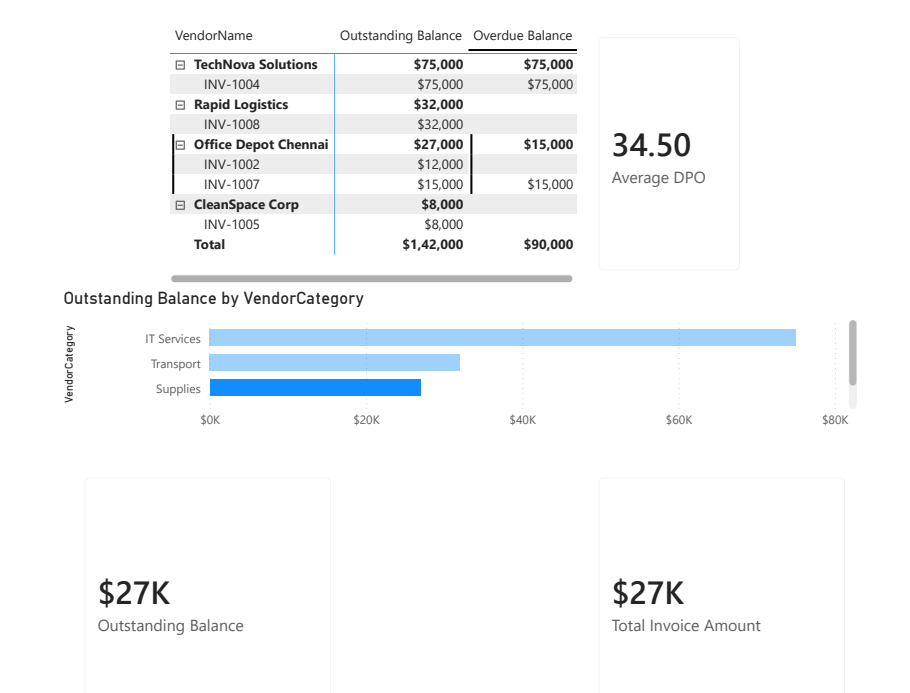

# 📊 Accounts Payable (AP) BI Framework


## 📌 Executive Summary
Managing cash flow is critical to business survival. This project is an end-to-end **Accounts Payable BI Framework** designed to give finance executives and AP managers immediate visibility into cash liabilities, vendor risk, and invoice aging.

**The Business Impact:** Moving from static Excel reports to a dynamic, automated framework allows the finance team to instantly identify overdue invoices, optimize the Days Payable Outstanding (DPO), and prevent vendor relationship degradation.

---

## 👁️‍🗨️ Dashboard Preview
*(Recruiter Note: Click the image below to view the full PDF export, or download the `.pbix` file to interact with the live model.)*

<p align="center">
  <a href="Project1_AP_Dashboard.pdf">
    
  </a>
</p>

---

## 📈 Key Performance Indicators (KPIs) Built
* **Total Invoice Amount ($387K):** Total volume of transactions processed.
* **Outstanding Balance ($142K):** Total capital currently owed to vendors.
* **Overdue Balance:** Targeted filter context isolating debt past the payment terms.
* **Average DPO (25.40 Days):** Dynamic Days Payable Outstanding tracking payment efficiency against current date.

---

## 🛠️ Technical Architecture & Skills Demonstrated

### 1. Data Ingestion & ETL (Power Query)
* Extracted raw transactional and vendor data.
* Enforced data typing, handled missing values, and established strict naming conventions to separate descriptive data (`Dim`) from quantitative data (`Fact`).

### 2. Relational Data Modeling (Star Schema)
* Designed a One-to-Many Star Schema connecting `Dim_Vendors` to `Fact_Invoices`.
* Optimized model for fast rendering and DAX cross-filtering.

### 3. Advanced DAX (Data Analysis Expressions)
Showcasing ability to manipulate filter contexts and perform row-by-row time intelligence:

**Context Transition (Overdue Balance):**
```dax
Overdue Balance = 
CALCULATE(
    [Total Invoice Amount],
    Fact_Invoices[Status] = "Overdue"
)
